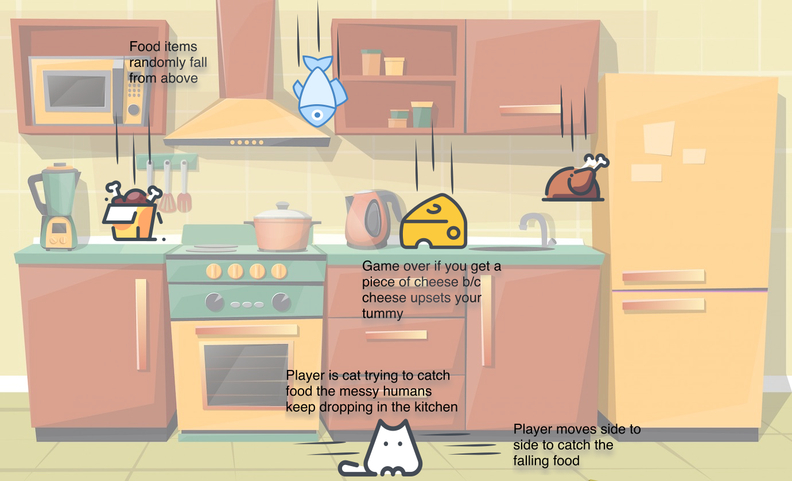

# Cat Scraps
You play as Stinky, a cat living in a house with some __*very*__ messy people. Your goal is to catch all the scraps of food the messy humans keep dropping. Just be sure not to snag any cheese or you'll end up with a very upset tummy! (A discovery that may or may not have been the origin story of your name.)

---
## Wireframe Mockup

---
## MVP Goals
- Create cat & spawn in middle of the canvas
- Bind side-to-side movement to both 'A' & 'D' keys as well as left & right arrow keys
- Create edge detection to prevent cat from going off screen
- Create & render random falling items that can be good (chicken, turkey, fish) or bad (cheese)
- Create hit detection to determine if good food is caught
- Create hit detection to determine if bad food is caught & end game
- Add game over screen

***
## Stretch Goals
- Add counter for number of food items caught
- Add 'new game' button
- Add highscore  tracker
- Add hard mode that will also end the game if too many good food items aren't caught (humans realized how messy they're being)
- Add cute sprites
- Add kitchen background
- Add sound effects

---
## Play the Game!
[Here](https://emily-herndon.github.io/Cat-Scraps/)

---
### Tech Stacks
- HTML/CSS (Canvas to hold the game)
- JavaScript
---
# Image Sources
- Sprites courtesy of Vectornator's Iconator library
- [Kitchen Background]("https://www.freepik.com/vectors/kitchen-cartoon") created by vectorpocket 
- [Cat Paw background]("https://www.freepik.com/vectors/cat") created by pch.vector 
